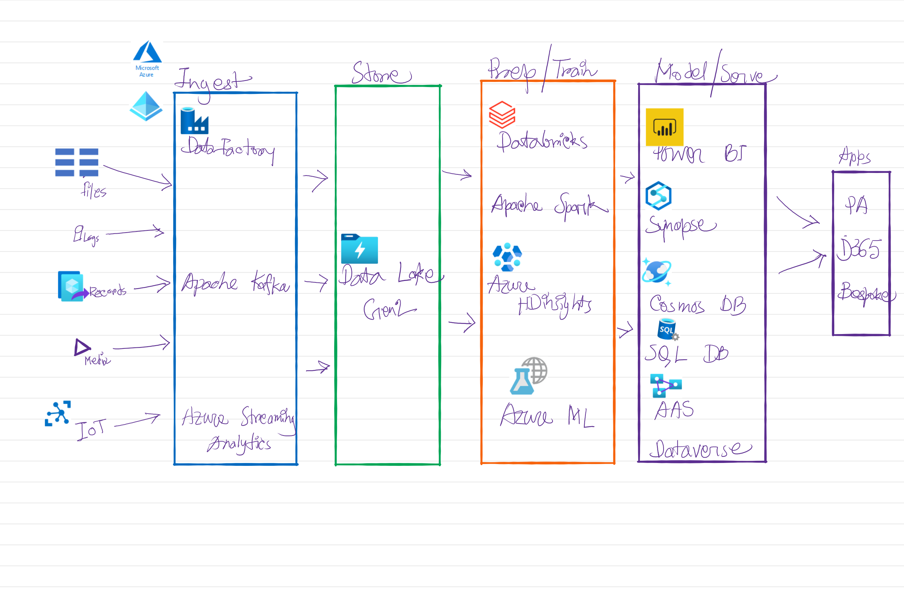

Read about Storage options for Data in Azure today. Starting with Data Lake which is a repository of data that is stored in its natural format, usually as blobs or files. 

Azure Data Lake Storage Gen2 is designed to deal with the variety and volume of data at exabyte scale while securely handling hundreds of gigabytes of throughput. It has the benefits of Hadoop Distributed File System (HDFS) compatibility, supports access control lists (ACLs) and Portable Operating System Interface (POSIX) permissions, and all the redundancy features of the Azure Blob.\
\
There are four stages for processing big data solutions that are common to all architectures :

* Data Ingestion - This phase identifies the technology and processes that are used to acquire the source data. This data can come from files, logs, and other types of unstructured data that must be put into the Data Lake Store.The technology used can vary based on teh solution. For example, for batch movement of data, Azure Data Factory may be the most appropriate technology to use. For real-time ingestion of data, Apache Kafka for HDInsight or Stream Analytics may be an appropriate technology to use.
* Data Storage  - The store phase identifies where the ingested data should be placed. In this case, we're using Azure Data Lake Storage Gen2.
* Prep and train - The prep and train phase identifies the technologies that are used to perform data preparation, model training for analysis and scoring for data science solutions. The common technologies that are used in this phase are Azure Synapse Analytics, Azure Databricks, Azure HDInsight or Azure Machine Learning Services.
* Model and serve - Finally, the model and serve phase involves the technologies that will present the data to users. These can include visualisation tools such as Power BI, or other data stores such as Azure Synapse Analytics, Azure Cosmos DB, Azure SQL Database, or Azure Analysis Services. Often, a combination of these technologies will be used depending on the business requirements.

  